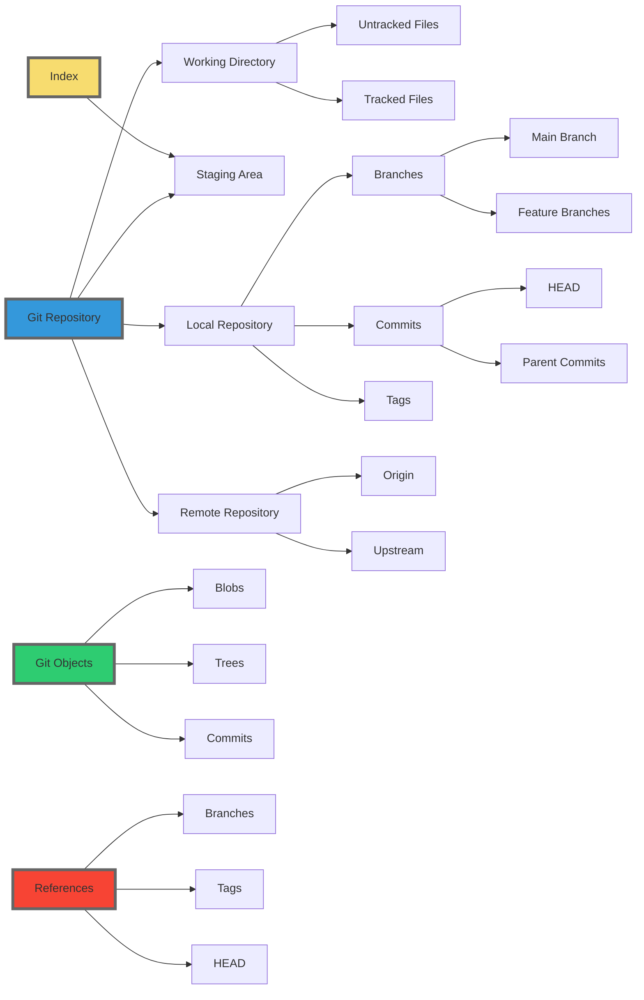

# Git Commands: Usage Guide with Key Differences

| Command | Syntax | Description | Key Differences | When to Use | Level |
|---------|--------|-------------|-----------------|-------------|-------|
| `git init` | `git init` | Initializes a new Git repository | Creates a new .git directory | When starting a new project from scratch | Basic |
| `git clone` | `git clone <repo-url>` | Creates a copy of a remote repository locally | Downloads the entire repository history | When you want to start working on an existing project | Basic |
| `git add` | `git add <file>` or `git add .` | Stages changes for commit | Prepares changes for commit but doesn't record them | After making changes and before committing | Basic |
| `git commit` | `git commit -m "message"` | Saves staged changes to the repository | Actually records changes to the repository | After staging changes, to save your work | Basic |
| `git push` | `git push origin <branch>` | Uploads local branch commits to a remote repository | Sends commits to remote, unlike fetch/pull which retrieve | When you want to share your local commits with others | Basic |
| `git pull` | `git pull origin <branch>` | Fetches changes from a remote and merges them | Combines fetch and merge in one step | When you want to update your local branch with remote changes | Basic |
| `git fetch` | `git fetch <remote>` | Downloads objects and refs from another repository | Unlike pull, doesn't automatically merge changes | When you want to see what others have been working on without merging | Intermediate |
| `git merge` | `git merge <branch>` | Combines changes from different branches | Creates a new commit, unlike rebase | When you want to integrate changes from another branch | Intermediate |
| `git branch` | `git branch <branch-name>` | Creates, lists, renames, and deletes branches | Doesn't switch to the new branch automatically | When you want to create a new line of development | Intermediate |
| `git checkout` | `git checkout <branch-name>` | Switches to a different branch | Changes the working directory, unlike branch | When you want to switch to a different branch or restore files | Intermediate |
| `git checkout -b` | `git checkout -b <new-branch>` | Creates a new branch and switches to it | Combines branch creation and checkout in one step | When you want to create a new branch and immediately start working on it | Intermediate |
| `git remote add` | `git remote add <name> <url>` | Adds a new remote repository | Doesn't fetch from the new remote automatically | When you want to connect your local repo to a new remote repository | Intermediate |
| `git stash` | `git stash` | Temporarily stores modified, tracked files | Allows switching branches without committing changes | When you need to switch branches but aren't ready to commit your changes | Intermediate |
| `git rebase` | `git rebase <base>` | Reapplies commits on top of another base tip | Rewrites commit history, unlike merge | When you want to integrate changes and maintain a linear project history | Advanced |
| `git cherry-pick` | `git cherry-pick <commit-hash>` | Applies changes from specific commits | Allows selecting specific commits, unlike merge/rebase | When you want to apply a specific commit from one branch to another | Advanced |
| `git reset` | `git reset <file>` or `git reset --hard <commit>` | Unstages changes or resets HEAD | Can alter commit history, unlike revert | When you need to undo commits or unstage changes | Advanced |
| `git reflog` | `git reflog` | Manages reflog information | Shows a log of changes to branch tips, useful for recovery | When you need to recover lost commits or branches | Advanced |
| `git bisect` | `git bisect start` | Uses binary search to find problematic commit | Automates the process of finding which commit introduced a bug | When you're trying to find which commit introduced a bug | Advanced |

